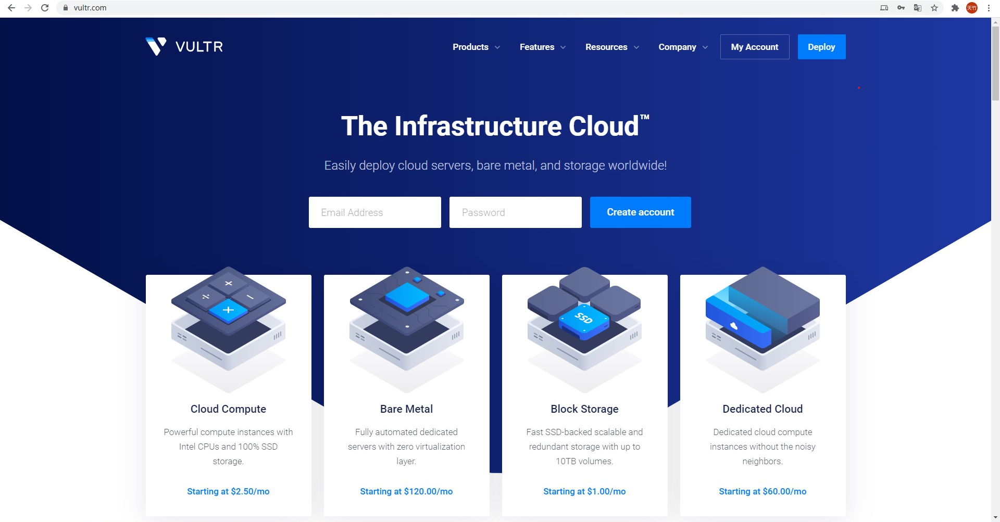
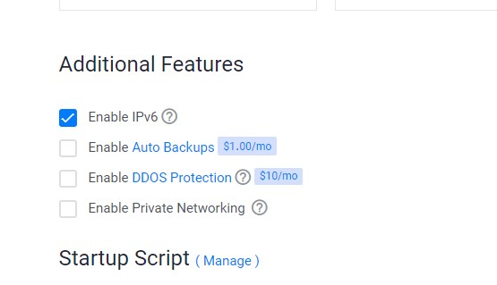

# IPV6-in-SUSTech
这是一篇介绍如何在南方科技大学（SUSTech）使用IPV6来进行网络提速/访问纯ipv6站点的教程，非常详细。介绍了每一个（x）会触及到的坑。

## 为什么制作本教程

制作者本人是计系菜鸡，见到很多大佬使用校园网高速下载各种软件，访问各种站点。当询问大佬时，大佬为我指出了2个关键字：ipv6和vps。在尝试过程中，踩了许多坑，浪费了很多时间（甚至错过了cyberpunk2077的预下载时间）。节省后来人的时间是创作本教程的第一动力。

## 为什么能加速？

根据[南科手册](https://sustech.online/#%E5%A6%82%E6%9E%9C%E4%BD%A0%E6%98%AF%E6%96%B0%E7%94%9F)给出的消息，学校目前拥有4Gbps电信163出口带宽，2.5Gbps电信CN2出口带宽，以及1.5Gbps教育网出口带宽。[ (opens new window)](https://biddingoffice.sustc.edu.cn/search/news/id/5085/pid)学校信息中心会将访问境外网站的流量发往CN2出口，因此学校内访问境外网站的质量会显著高于普通电信网络。

学校目前对普通网段设备限速8Mbps，对科研教学网段限速50Mbps，对教育网IPv4限速20Mbps，**暂不对教育网IPv6限速**。

## 使用效果

完成本教程后，你将可以高速访问ipv6站点，并且可以科学上网功能。本教程参考了[V2Ray完全使用教程](https://yuan.ga/v2ray-complete-tutorial/)

## 所需工具

**境外VPS**

任何境外 VPS 都可以，一般而言香港、台湾、新加坡、韩国、日本等亚洲机房速度（延迟小）最快，但价格贵并且由于用的人多经常会被重点关照。无论如何，如果预算充足并追求速度可以选择这些机房，但需要提前了解测试线路是否是直连中国，一些线路可能会绕美国。

## VPS的配置——以vultr为例

首先，我们需要创建一个[VULTR](https://www.vultr.com/)账号。



选择Dallas站点，选CentOS，最便宜的5美刀/月就够用



记住一定要打开IPV6。

安装SSH工具来远程连接服务器。


使用233一键配置脚本。

```
bash <(curl -s -L https://git.io/v2ray.sh)
```

关掉防火墙。

```
#停止firewall
systemctl stop firewalld

#禁止firewall开机启动
systemctl disable firewalld
```

获得url之后，把地址改成服务器的ipv6地址即可。

下载proxyfier

用户名随意填
注册码下边，三选一
5EZ8G-C3WL5-B56YG-SCXM9-6QZAP
G3ZC7-7YGPY-FZD3A-FMNF9-ENTJB
YTZGN-FYT53-J253L-ZQZS4-YLBN9


